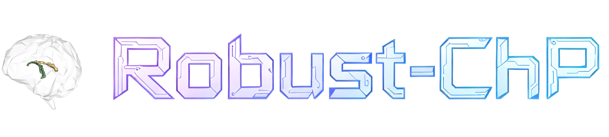

<!-- PROJECT SHIELDS -->

<p align="center">
  <a href="https://github.com/Mr-Guowang/Robust-ChP/graphs/contributors">
    
  </a>
  <a href="https://github.com/Mr-Guowang/Robust-ChP/network/members">
    
  </a>
  <a href="https://github.com/Mr-Guowang/Robust-ChP/stargazers">
    
  </a>
  <a href="https://github.com/Mr-Guowang/Robust-ChP/issues">
    
  </a>
  <a href="https://github.com/Mr-Guowang/Robust-ChP/blob/main/LICENSE">
    
  </a>
</p>


<!-- PROJECT LOGO -->
<br />
<div align="center">
  <a href="https://github.com/Mr-Guowang/Robust-ChP">
    
  </a>

  <h3 align="center">A plug-and-play robust choroid plexus segmentation tool</h3>
  <h3 align="center">[Support segmentation and measurement of choroid plexus (volume, surface area, etc.)]</h3>

  <p align="center">
    The complete model weights and Docker image will be open-source after the paper accepted. The dataset will be made available on request(Please contact the corresponding author by email). 
    <br />
    <a href="https://github.com/Mr-Guowang/Robust-ChP">Dataset(soon be open source in *Scientific Data*)</a>
    &middot;
    <a href="https://github.com/Mr-Guowang/Robust-ChP">Paper(under review)</a>
  </p>
</div>

<!-- TABLE OF CONTENTS -->
<details>
  <summary>Table of Contents</summary>
  <ol>
    <li>
      <a href="#latest-updates">Latest Updates</a>
    </li>
    <li>
  <a href="#getting-started-via-docker">Getting Started via Docker</a>
  <ul>
    <li><a href="#docker-prerequisites">Prerequisites</a></li>
    <li><a href="#pull-the-docker-image">Pull the Docker image</a></li>
    <li><a href="#run-the-pipeline">Run the pipeline</a></li>
    <li><a href="#command-line-arguments">Command-Line Arguments</a></li>
    <li><a href="#output-directory-structure">Output Directory Structure</a></li>
  </ul>
</li>
<li>
  <a href="#getting-started-via-python">Getting Started via Python</a>
  <ul>

  </ul>
</li>
    <li><a href="#contributing">Contributing</a></li>
    <li><a href="#acknowledgments">Acknowledgments</a></li>
    <li><a href="#citation">Citation</a></li>
  </ol>
</details>


<!-- ABOUT THE PROJECT -->
## Latest Updates

**Maintenance Notice**
> This repository is under continuous maintenance.  
> New features, fixes, and documentation updates will be released here.

| Date | Update |
|----------------------------|----------------------------|
| 2026-03-30 | Updated version of Python implementation. |
| 2026-03-25 | Added a deep learning method **synthmorph**  (substitute for ANTs, faster). |
| 2026-03-14 | Added **Robust-ChP Version 1**. |

<p align="right">(<a href="#readme-top">back to top</a>)</p>


<!-- GETTING STARTED -->
## GETTING STARTED VIA DOCKER

To maximize portability and usability, and to spare users from tedious software installation and system-level configuration, we provide a **prebuilt Docker image**, which means users do **not** need to manually install other dependencies.
> ⚠️ **Notice**  
> Docker image will go online again after the paper is officially accepted.

### Prerequisites

Before running the pipeline, please make sure the following are available:

- **Docker**  
  Install [Docker Desktop](https://www.docker.com/products/docker-desktop/) on Windows/macOS, or Docker Engine on Linux.

  

- **A valid FreeSurfer license**  
  FreeSurfer is required by the preprocessing workflow. Please obtain a valid `license.txt` from the [official FreeSurfer registration page](https://surfer.nmr.mgh.harvard.edu/registration.html).

- **Input MRI data**  
  This release currently supports **T1-weighted MRI** as input.

### Pull the Docker image

```sh
docker pull ggbondzzx/robust-chp:lilab-v1.1
```
### Run the pipeline

A generic example is shown below:
```sh
docker run --rm -it \
  --mount type=bind,src="<PATH_TO_LICENSE>/license.txt",dst=/opt/freesurfer/license.txt,readonly \
  --mount type=bind,src="<PATH_TO_INPUT_DIR>",dst=/data,readonly \
  --mount type=bind,src="<PATH_TO_OUTPUT_DIR>",dst=/out \
  ggbondzzx/robust-chp:lilab-v1.1 \
  run_robustchp.sh \
  --input /data/<INPUT_T1W_FILE>.nii.gz \
  --output /out \
  --gpu <GPU_ID> \
  --modal T1w \
  --analysis
```
#### Command-Line Arguments

| Argument | Type | Description |
|----------|------|-------------|
| `--input` | `str` | Absolute path to the input MRI inside the container. In the Docker examples above, this should usually be specified under `/data/`. |
| `--output` | `str` | Absolute path to the output directory inside the container. In the Docker examples above, this is typically `/out`. |
| `--gpu` | `str` | GPU device identifier. Use a non-negative integer such as `0` to run on a specific GPU, or use `-1` to force CPU-only execution. |
| `--modal` | `str` | Input modality. The current release supports `T1w`. |
| `--analysis` | `flag` | Enables post-segmentation refinement and quantitative analysis. |

#### Output Directory Structure

Robust-ChP writes intermediate segmentation outputs, and optional quantitative statistics into a structured output directory under the user-specified `--output` path.

A typical output layout is shown below:

```text
<OUTPUT_DIR>/
├── step_4_Robust-ChP/
│   ├── ChP/
│   │   ├── chp.nii.gz
│   │   └── chp4aseg.nii.gz (Follow Freesurfer's lookuptable)         
│   └── stats/
│       └── stats.json (Morphological quantitative indicators)                  
```

<!-- GETTING STARTED VIA PYTHON -->
## GETTING STARTED VIA PYTHON
For users who prefer a native Python workflow, we also provide a Python-based execution mode for local development, debugging, and customized integration into existing analysis pipelines.
> ⚠️ **Notice**  
> The **structural subspace**, **ChP Atlas**, and **pretrained model weights** are not included in this release.  
> They will be made publicly available after the paper is officially accepted.

### Installation

Please first clone the repository and enter the Python package directory:

```sh
git clone https://github.com/Mr-Guowang/Robust-ChP.git
cd ./Robust-ChP/SPIN-ChPSeg
pip install -e .
```
> This project is partially built upon the [nnU-Net framework](https://github.com/MIC-DKFZ/nnUNet).  
> Please also refer to the official nnU-Net repository for environment preparation and dependency details when necessary.
### Run the pipeline
Once the environment is installed, you can directly execute the following commands:
```sh
python ./Robust-ChP/SPIN-ChPSeg/ChP_Net/run_in_ants.py --[Arguments]
```
The [arguments] is exactly the same as that in docker. You can also view help:
```sh
python ./Robust-ChP/SPIN-ChPSeg/ChP_Net/run_in_ants.py -h
```
<!-- CONTRIBUTING -->
## Contributing

Contributions are what make the open source community such an amazing place to learn, inspire, and create. Any contributions you make are **greatly appreciated**.

If you have a suggestion that would make this better, please fork the repo and create a pull request. You can also simply open an issue with the tag "enhancement".
Don't forget to give the project a star! Thanks again!

1. Fork the Project
2. Create your Feature Branch (`git checkout -b feature/AmazingFeature`)
3. Commit your Changes (`git commit -m 'Add some AmazingFeature'`)
4. Push to the Branch (`git push origin feature/AmazingFeature`)
5. Open a Pull Request

### Top contributors:

<a href="https://github.com/Mr-Guowang/Robust-ChP/graphs/contributors">
  
</a>

<p align="right">(<a href="#readme-top">back to top</a>)</p>


<!-- ACKNOWLEDGMENTS -->
## Acknowledgments

This project was developed with reference to the following excellent open-source projects and tools:

- [SynthSeg](https://github.com/BBillot/SynthSeg)
- [SynthStrip](https://surfer.nmr.mgh.harvard.edu/docs/synthstrip/)
- [ANTs](https://github.com/ANTsX/ANTs/releases)
- [nnU-Net](https://github.com/mic-dkfz/nnunet)

<p align="right">(<a href="#readme-top">back to top</a>)</p>

<!-- CITATION -->
## Citation

If you find this project useful in your research, please consider citing our work:

```bibtex
@misc{robustchp2026,
  title   = {Robust-ChP: A Plug-and-Play Robust Choroid Plexus Segmentation Tool},
  author  = {Guowang and colleagues},
  year    = {2026},
  note    = {Manuscript under review},
  url     = {https://github.com/Mr-Guowang/Robust-ChP}
}
```
<!-- MARKDOWN LINKS & IMAGES -->
<!-- https://www.markdownguide.org/basic-syntax/#reference-style-links -->
[contributors-shield]: https://img.shields.io/github/contributors/Mr-Guowang/Robust-ChP.svg?style=for-the-badge
[contributors-url]: https://github.com/Mr-Guowang/Robust-ChP/graphs/contributors
[forks-shield]: https://img.shields.io/github/forks/Mr-Guowang/Robust-ChP.svg?style=for-the-badge
[forks-url]: https://github.com/Mr-Guowang/Robust-ChP/network/members
[stars-shield]: https://img.shields.io/github/stars/Mr-Guowang/Robust-ChP.svg?style=for-the-badge
[stars-url]: https://github.com/Mr-Guowang/Robust-ChP/stargazers
[issues-shield]: https://img.shields.io/github/issues/Mr-Guowang/Robust-ChP.svg?style=for-the-badge
[issues-url]: https://github.com/Mr-Guowang/Robust-ChP/issues
[license-shield]: https://img.shields.io/github/license/Mr-Guowang/Robust-ChP.svg?style=for-the-badge
[license-url]: https://github.com/Mr-Guowang/Robust-ChP/blob/master/LICENSE.txt
[product-screenshot]: images/screenshot.png
[Next.js]: https://img.shields.io/badge/next.js-000000?style=for-the-badge&logo=nextdotjs&logoColor=white
[Next-url]: https://nextjs.org/
[React.js]: https://img.shields.io/badge/React-20232A?style=for-the-badge&logo=react&logoColor=61DAFB
[React-url]: https://reactjs.org/
[Vue.js]: https://img.shields.io/badge/Vue.js-35495E?style=for-the-badge&logo=vuedotjs&logoColor=4FC08D
[Vue-url]: https://vuejs.org/
[Angular.io]: https://img.shields.io/badge/Angular-DD0031?style=for-the-badge&logo=angular&logoColor=white
[Angular-url]: https://angular.io/
[Svelte.dev]: https://img.shields.io/badge/Svelte-4A4A55?style=for-the-badge&logo=svelte&logoColor=FF3E00
[Svelte-url]: https://svelte.dev/
[Laravel.com]: https://img.shields.io/badge/Laravel-FF2D20?style=for-the-badge&logo=laravel&logoColor=white
[Laravel-url]: https://laravel.com
[Bootstrap.com]: https://img.shields.io/badge/Bootstrap-563D7C?style=for-the-badge&logo=bootstrap&logoColor=white
[Bootstrap-url]: https://getbootstrap.com
[JQuery.com]: https://img.shields.io/badge/jQuery-0769AD?style=for-the-badge&logo=jquery&logoColor=white
[JQuery-url]: https://jquery.com 
